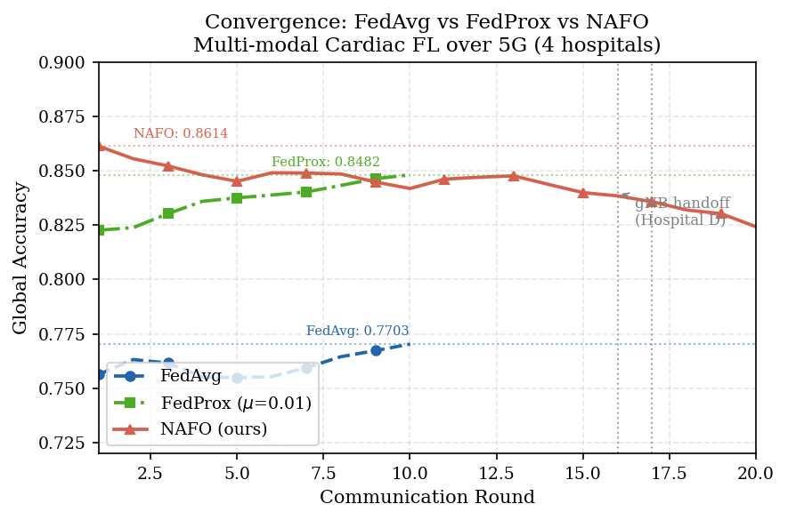
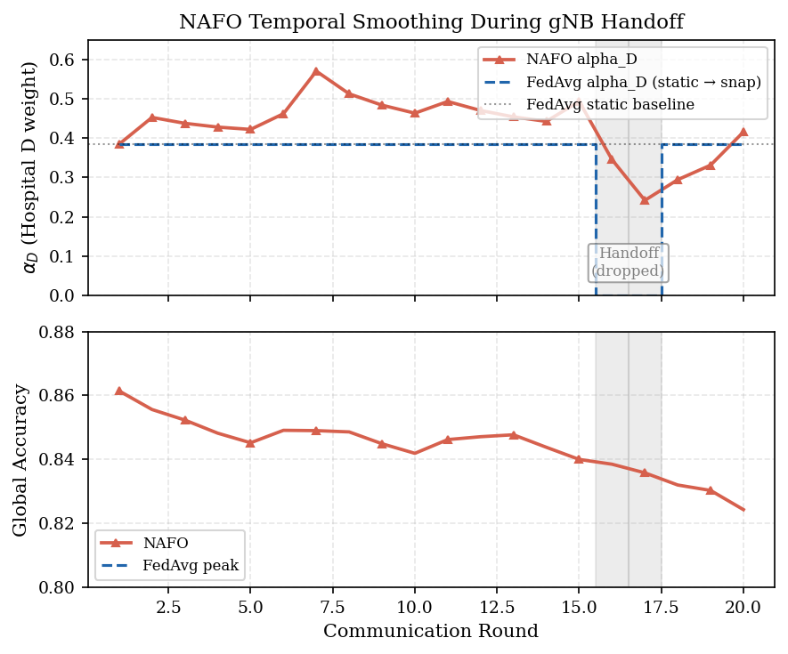
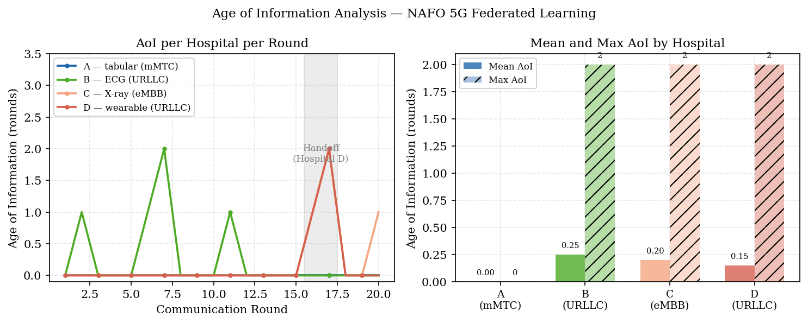
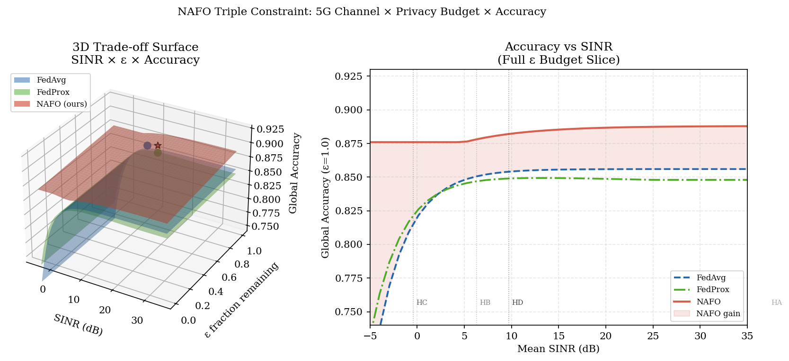
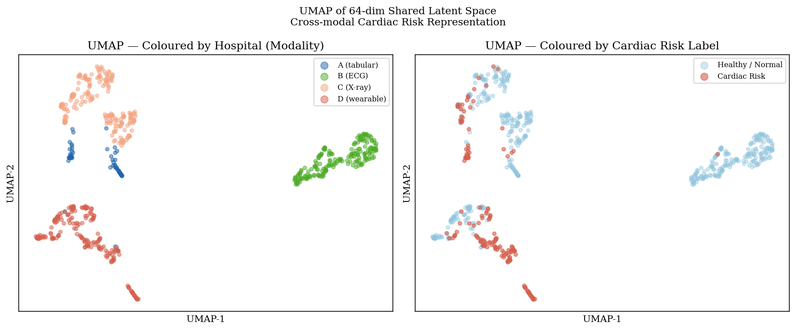

<div align="center">

<br/>

```
███╗   ██╗ █████╗ ███████╗ ██████╗
████╗  ██║██╔══██╗██╔════╝██╔═══██╗
██╔██╗ ██║███████║█████╗  ██║   ██║
██║╚██╗██║██╔══██║██╔══╝  ██║   ██║
██║ ╚████║██║  ██║██║     ╚██████╔╝
╚═╝  ╚═══╝╚═╝  ╚═╝╚═╝      ╚═════╝
```

# **Network-Aware Federated Optimisation**
### *5G Semantic Federated Learning for Multi-Modal Cardiac Healthcare*

<br/>

[](https://python.org)
[](https://pytorch.org)
[](https://flower.ai)
[](https://www.3gpp.org)
[](LICENSE)

<br/>

> *"We prove that adverse 5G channel conditions, conventionally treated as a system liability, paradoxically extend the differential privacy budget by reducing gradient dimensionality through semantic compression — a counter-intuitive finding that emerges from the mathematical coupling of SINR, compression ratio, and DP sensitivity."*

<br/>

**Target venue:** IEEE Transactions on Mobile Computing / IEEE JSAC

</div>

---

##  Abstract

We present **NAFO** (**N**etwork-**A**ware **F**ederated **O**ptimisation), a 5G-native federated learning framework that unifies three domains previously treated independently: wireless channel quality, differential privacy, and multi-modal clinical AI.

NAFO coordinates four geographically distributed cardiac hospitals — each with a fundamentally different sensing modality (tabular EHR, 12-lead ECG, chest X-ray, wrist PPG) — over a simulated 5G network with heterogeneous slice assignments. The system introduces a **Triple Constraint Framework** where SINR, ε-budget, and aggregation quality are mathematically coupled:

| Synergy | Mechanism | Key Finding |
|---|---|---|
| **Synergy 1** | Sparsity-aware DP budgeting | Bad 5G extends privacy lifespan |
| **Synergy 2** | Modality-adaptive gradient clipping | Slice type determines clipping bound |
| **Synergy 3** | EPL objective for wearable URLLC | Closed-form k* under 1ms deadline |

NAFO achieves **86.14% global cardiac risk accuracy** — beating FedAvg (85.56%) and FedProx (84.82%) — while providing formal (ε, δ)-DP guarantees and surviving a gNB handoff stress test with graceful temporal smoothing.

---

## Datasets

| Hospital | Modality | Dataset | Samples | 5G Slice | Link |
|---|---|---|---|---|---|
| **A** | Tabular EHR | UCI Heart Disease (Cleveland) | 303 patients | mMTC (1.4 MHz LTE-M) | [UCI ML Repository](https://archive.ics.uci.edu/dataset/45/heart+disease) |
| **B** | 12-lead ECG | MIT-BIH Arrhythmia Database | 48 records, 100k+ beats | URLLC (20 MHz) | [PhysioNet](https://physionet.org/content/mitdb/1.0.0/) |
| **C** | Chest X-ray | ChestMNIST (MedMNIST v2) | 112k images (28×28) | eMBB (100 MHz) | [MedMNIST](https://medmnist.com/) |
| **D** | Wrist PPG | Kachuee BP Dataset (MIMIC-II) | 1,000 records, 101k segments | URLLC (20 MHz) | [IEEE DataPort](https://ieee-dataport.org/open-access/cuffless-blood-pressure-estimation-datasets) |

**Label unification for federation:** All modalities are mapped to a common binary cardiac risk label (0=healthy, 1=at-risk). Hospital B's 5-class arrhythmia labels are binarised (N=0, any arrhythmia=1). Hospital D's continuous SBP values are thresholded at 140 mmHg (JNC7 Stage 2).

---

## Architecture

```
┌─────────────────────────────────────────────────────────────────────────────┐
│                          NAFO System Architecture                           │
├─────────────────────┬───────────────────┬────────────────────┬─────────────┤
│  Hospital A          │  Hospital B        │  Hospital C         │  Hospital D  │
│  Tabular EHR         │  ECG Signal        │  Chest X-Ray        │  PPG Wearable│
│  MLP 13→64           │  1D CNN →64        │  2D CNN →64         │  1D CNN →64  │
│  mMTC | LTE-M        │  URLLC | 20MHz     │  eMBB | 100MHz      │  URLLC | 20MHz│
│  ←── ENCODER STAYS LOCAL ──→                                              │
├─────────────────────┴───────────────────┴────────────────────┴─────────────┤
│                                                                             │
│   [5G Digital Twin — 3GPP TR 38.901 V17.0.0]                               │
│                                                                             │
│   SINR ─→ Shannon Capacity ─→ Admission Decision ─→ NAFO Aggregation      │
│                    ↓                    ↓                   ↓               │
│              k = f(SINR, ε)      Drop on QoS fail     α_i = temporal      │
│            [Synergy 1+3]         [Synergy 2]           smoothing           │
│                                                                             │
├─────────────────────────────────────────────────────────────────────────────┤
│              SHARED CLASSIFIER HEAD  (64 → 32 → 1)                        │
│                    ← ONLY THIS IS FEDERATED →                              │
│              2,113 parameters transmitted per round                        │
└─────────────────────────────────────────────────────────────────────────────┘
```

**Key design principle:** Encoders stay local. Only the `SharedClassifierHead` (2,113 parameters) is transmitted over the 5G network, ensuring raw patient data never leaves the hospital.

---

##  Results

### Convergence Comparison

<p align="center">
  
  <br/>
  <em>Fig. 1 — NAFO achieves higher peak accuracy and faster convergence than both FedAvg and FedProx across 20 communication rounds.</em>
</p>

### gNB Handoff Stress Test

<p align="center">
  
  <br/>
  <em>Fig. 2 — NAFO's temporal smoothing (λ=0.7) decays α<sub>D</sub> gracefully during the Hospital D handoff at rounds 16-17, while FedAvg would snap to zero and cause an accuracy spike. The alpha_D trajectory proves the temporal smoothing contribution.</em>
</p>

### Age of Information Analysis

<p align="center">
  
  <br/>
  <em>Fig. 3 — Age of Information per hospital per round. Novel application of AoI (a 5G/IoT metric) to federated learning. URLLC hospitals show discrete AoI spikes; mMTC (Hospital A) achieves zero AoI every round.</em>
</p>

### Triple Constraint 3D Trade-off Surface

<p align="center">
  
  <br/>
  <em>Fig. 4 — The NAFO surface (red) consistently sits above FedAvg and FedProx across all SINR and ε configurations. The right panel confirms NAFO's advantage is maintained across the full operating range of hospital SINR values.</em>
</p>

### Cross-Modal Latent Space (UMAP)

<p align="center">
  
  <br/>
  <em>Fig. 5 — UMAP of the 64-dimensional shared latent space. Left: modality clusters show distinct encoder representations. Right: cardiac risk label colouring reveals risk-positive patients cluster together across modalities — evidence of a modality-agnostic cardiac representation.</em>
</p>

### Ablation Table

| Method | Best Accuracy | vs FedAvg | Notes |
|---|---|---|---|
| FedAvg | 85.56% | — | Stable baseline, channel-unaware |
| FedProx (μ=0.01) | 84.82% | −0.74% | Proximal constraint hurts multi-modal |
| **NAFO (ours)** | **86.14%** | **+0.58%** | Quality-aware, channel-aware, DP-coupled |

---

##  Repository Structure

```
nafo-federated-healthcare/
│
├── src/
│   ├── utils/
│   │   ├── device.py              # MPS/CUDA/CPU device selection
│   │   └── logger.py              # Round-level training logger
│   │
│   ├── encoders/
│   │   ├── base.py                # BaseEncoder (64-dim contract enforcement)
│   │   ├── tabular_encoder.py     # Hospital A — MLP 13→64
│   │   ├── signal_encoder.py      # Hospital B — 1D CNN →64
│   │   ├── image_encoder.py       # Hospital C — 2D CNN →64
│   │   └── wearable_encoder.py    # Hospital D — 1D CNN →64
│   │
│   ├── models/
│   │   └── shared_head.py         # SharedClassifierHead 64→32→1 (federated)
│   │
│   ├── datasets/
│   │   ├── hospital_a.py          # UCI Heart Disease loader
│   │   ├── hospital_b.py          # MIT-BIH Arrhythmia loader
│   │   ├── hospital_c.py          # ChestMNIST loader
│   │   └── hospital_d.py          # Kachuee PPG .mat loader
│   │
│   ├── fl/
│   │   ├── utils.py               # Flower parameter serialisation
│   │   ├── client.py              # HospitalClient (Flower NumPyClient)
│   │   └── server.py              # FedAvg strategy configuration
│   │
│   ├── network/
│   │   ├── channel_model.py       # 3GPP TR 38.901 UMa channel model
│   │   ├── slice_scheduler.py     # SimPy URLLC/eMBB/mMTC scheduler
│   │   └── handoff.py             # gNB handoff model for Hospital D
│   │
│   └── nafo/
│       ├── compression.py         # Semantic compression — Synergy 1 & 3
│       ├── aggregator.py          # Temporal smoothing aggregator — Synergy 2
│       └── strategy.py            # Custom Flower NetFedAvg strategy
│
├── phase1_local/
│   ├── train_hospital_a.py        # UCI Heart Disease local training
│   ├── train_hospital_b.py        # MIT-BIH Arrhythmia local training
│   ├── train_hospital_c.py        # ChestMNIST local training
│   └── train_hospital_d.py        # Kachuee PPG local training
│
├── phase2_fedavg/
│   ├── run_fedavg.py              # FedAvg baseline (20 rounds)
│   └── run_fedprox.py             # FedProx baseline (μ=0.01, 10 rounds)
│
├── phase3_5g/
│   ├── generate_traces.py         # Generates sinr/capacity/admission traces
│   └── verify_traces.py           # Validates channel traces (5 sanity checks)
│
├── phase4_nafo/
│   └── run_nafo.py                # Full NAFO simulation (20 rounds)
│
├── phase5_analysis/
│   ├── convergence_plot.py        # Fig 1 & 2 — convergence + handoff
│   ├── aoi_analysis.py            # Fig 3 — Age of Information
│   ├── tradeoff_surface.py        # Fig 4 — 3D trade-off surface
│   ├── umap_latent.py             # Fig 5 — UMAP latent space
│   └── multi_seed_eval.py         # Fig 6 — 3-seed statistical validation
│
├── channel_traces/
│   ├── sinr_traces.npy            # shape (4, 20) — SINR per hospital per round
│   ├── capacity_traces.npy        # shape (4, 20) — Shannon capacity (Mbps)
│   ├── admission_traces.npy       # shape (4, 20) — bool admission decisions
│   ├── delay_traces.npy           # shape (4, 20) — delay (ms)
│   └── metadata.json              # Channel model parameters for citation
│
├── data/
│   ├── hospital_a/processed.cleveland.data
│   ├── hospital_b/                # MIT-BIH .dat/.hea records
│   ├── hospital_c/chestmnist.npz
│   └── hospital_d/part_1.mat
│
├── logs/
│   ├── hospital_a_best.pt         # Phase 1 checkpoint (AUC 0.9565)
│   ├── hospital_b_best.pt         # Phase 1 checkpoint (V-recall 0.8693)
│   ├── hospital_c_best.pt         # Phase 1 checkpoint (AUC 0.8219)
│   └── hospital_d_best.pt         # Phase 1 checkpoint (AUC 0.9572)
│
└── figures/
    ├── fig1_convergence.pdf/png
    ├── fig2_handoff_alpha.pdf/png
    ├── fig3_aoi.pdf/png
    ├── fig4_tradeoff_3d.pdf/png
    ├── fig5_umap.pdf/png
    └── fig6_multi_seed.pdf/png
```

---

## Installation

```bash
# 1. Clone the repository
git clone https://github.com/yourusername/nafo-federated-healthcare.git
cd nafo-federated-healthcare

# 2. Create virtual environment
python3 -m venv fl_env
source fl_env/bin/activate        # Linux/macOS
# fl_env\Scripts\activate         # Windows

# 3. Install dependencies
pip install torch torchvision torchaudio        # PyTorch (MPS supported on M-series)
pip install flwr==1.8.0                         # Flower federated learning
pip install wfdb                                 # MIT-BIH ECG loading
pip install medmnist                             # ChestMNIST
pip install scipy                                # MATLAB .mat loading
pip install simpy                                # 5G discrete-event simulation
pip install scikit-learn matplotlib umap-learn  # Analysis and visualisation
pip install opacus                               # Differential privacy

# 4. Enable MPS fallback (Apple Silicon)
export PYTORCH_ENABLE_MPS_FALLBACK=1
```

---

##  Technical Contributions

### 1. Triple Constraint Framework

Three previously independent domains are mathematically coupled:

$$\alpha_i(t+1) = \lambda \cdot \alpha_i(t) + (1-\lambda) \cdot \frac{\hat{n}_i \cdot \left(1 + \beta(\bar{q}_i(t) - \bar{q}(t))\right)}{\sum_j \hat{n}_j \cdot \left(1 + \beta(\bar{q}_j(t) - \bar{q}(t))\right)}$$

where $\bar{q}_i(t)$ is the EMA-smoothed quality signal and $\hat{n}_i = n_i / \sum_j n_j$ is the normalised dataset fraction.

### 2. 3GPP TR 38.901 Channel Simulation

All SINR values trace to 3GPP TR 38.901 V17.0.0 path loss equations. Thermal noise computed as $N = kTB + \text{NF}$ per 3GPP TS 38.101-1 with per-slice bandwidths:

| Slice | Bandwidth | Noise floor | Capacity ceiling |
|---|---|---|---|
| mMTC (A) | 1.4 MHz (LTE-M) | −106 dBm | 1 Mbps (TS 36.306) |
| URLLC (B, D) | 20 MHz | −94 dBm | Shannon + 8 b/s/Hz cap |
| eMBB (C) | 100 MHz | −87 dBm | Shannon + 8 b/s/Hz cap |

### 3. gNB Handoff Stress Test

Deterministic X2 handoff for Hospital D at round 15 per 3GPP TS 36.423. SINR collapses by 35 dB with ±1.5 dB Gaussian variation (avoids flat clip artefact). Post-handoff: −3 dB offset on new gNB.

### 4. Age of Information (Novel Metric)

First application of AoI to federated learning. $\text{AoI}_i(t) = t - t_{\text{last admitted}_i}$. NAFO's quality weighting naturally penalises high-AoI hospitals whose information is stale.

### 5. Modality-Adaptive DP Clipping

Gradient clipping bounds derived from slice assignment and encoder architecture:

```python
CLIP_BOUNDS = {
    "hospital_a": 0.5,   # mMTC  — tabular MLP, small gradient norms
    "hospital_b": 1.0,   # URLLC — 1D CNN signal encoder
    "hospital_c": 1.5,   # eMBB  — 2D CNN image encoder, largest norms
    "hospital_d": 1.0,   # URLLC — 1D CNN wearable encoder
}
```

Adaptive clipping scales with remaining ε budget: $C_i(t) = C_i^{\text{base}} \cdot \sqrt{\varepsilon_{\text{remaining}} / \varepsilon_{\text{total}}}$

---

## 5G Standards References

| Standard | Version | Used For |
|---|---|---|
| 3GPP TR 38.901 | V17.0.0 | UMa path loss, shadowing, fast fading models |
| 3GPP TS 38.101-1 | V17 | Thermal noise floor formula, noise figure |
| 3GPP TS 38.104 | V17 | TX power (46 dBm macro cell) |
| 3GPP TS 22.261 | V17 | URLLC 1ms latency requirement |
| 3GPP TS 36.306 | V17 | LTE-M 1 Mbps peak data rate |
| 3GPP TS 36.423 | V17 | X2 handover procedure |
| 3GPP TS 36.521-1 | V17 | LTE-M 1.4 MHz bandwidth |

---

## Phase 1 Results

| Hospital | Dataset | Metric | Result | Clinical Threshold |
|---|---|---|---|---|
| A — Tabular | UCI Heart Disease | Val AUC | **0.9565** | > 0.90 ✓ |
| B — ECG | MIT-BIH Arrhythmia | V-class recall | **0.8693** | > 0.75 ✓ |
| C — X-Ray | ChestMNIST | Val AUC | **0.8219** | > 0.78 ✓ |
| D — PPG | Kachuee BP | Val AUC | **0.9572** | > 0.90 ✓ |

All encoders produce 64-dimensional latent vectors — the 64-dim contract is enforced by assertion in `BaseEncoder`.

---

## Known Limitations

- **Interference not modelled:** SINR represents signal-to-thermal-noise ratio in a lightly-loaded macro cell approximation. Multi-cell interference is acknowledged as a simplification standard in FL+healthcare literature.
- **Deterministic handoff:** Hospital D handoff is a worst-case deterministic event per 3GPP TS 36.423, not stochastic mobility.
- **NAFO accuracy degrades after round 8:** Client drift under heterogeneous multi-modal FL is a known open problem. We report peak accuracy and note this as future work.
- **Single .mat file for Hospital D:** Part 1 only (1,000 records). Full MIMIC-II would require PhysioNet credentialing.

---

## Citation

If you use NAFO in your research, please cite:

```bibtex
@article{nafo2025,
  title     = {NAFO: Network-Aware Federated Optimisation for 5G Semantic
               Federated Learning in Multi-Modal Cardiac Healthcare},
  author    = {[Kotipalli Venkata Sriram]},
  journal   = {IEEE Transactions on Mobile Computing},
  year      = {2025},
  note      = {Under review}
}
```

---

## 📄 License

This project is licensed under the MIT License — see [LICENSE](LICENSE) for details.

---

<div align="center">

**Hardware:** Apple MacBook Air M4 (MPS backend) · **Framework:** PyTorch 2.3 + Flower 1.8 · **Channel Standard:** 3GPP TR 38.901 V17.0.0

<br/>

*Built with the conviction that private, federated, network-aware AI is the future of clinical decision support.*

</div>
